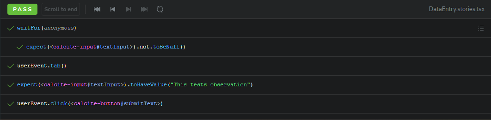

# Testing For Success ArcGIS Maps SDK for Javascript

This is the repository for demonstrating how to successfully test ArcGIS Maps SDK for Javascript. It is a very small React application that has an ArcGIS Map and an data entry tab on the side. The map watches user click events and display 'x' mark on its position. It then extracts latitude and longitude and display them the DataEntry tab which allows you to store the observation on the map.


The repository covers various testings including:

- integration testing
- end to end testing
- visual regression testing

Here, we additionally provide guidelines for optimizing testings to reduce testing time and network calls.

## Frameworks

Here's the list of following frameworks:

### Storybook

Storybook is a great tool for building, testing, and documenting components in isolation. Storybook enables you to develop UI components independently from the application. This makes it easier to focus on UI states, styles, and interactivity without being affected by backend logic.

Storybook provides many great addons such as checking accessibility (e.g. @storybook/addon-a11y), visual regression testing (chromatic), and interaction testing using @storybook/testing-library and @storybook/jest

To try our storybook, please do follow:

```sh
npm install
npm run storybook
```

You will see DataEntry tab ([/src/stories/DataEntry.stories.tsx](src/stories/DataEntry.stories.tsx)). That allows you to validate latitude and longitude when clicked on the map. Additionally, you can add observation by running the server together. The command for running the server is `npm run dev:server`.

#### Interaction Tests

Using `@storybook/addon-interactions` addon, you can run browser end-to-end test. Our test ensures the element loads, component properties are handled, and submit is handled.



### Vitest

### Playwright

Playwright is another great tool for e2e testing. Playwright supports Chromium, Webkit, and Firefox out of the box that don't need manual version updates. In our [demo](/__tests__/DataEntry.test.ts), we render our component, click the center of the map and capture the screenshot of DataEntry tab. Then, the image is compared with our screenshots/calcite-panel. Any discrepancy will be marked failure.

## Optimization

Optimization is another important area. Reducing the total testing time while getting the most accurate result is key to building a successful application. Here are few approaches for reducing the total time.

**E2E Testing:**

- mock services: Such interaction tests can be optimized by applying mock services. Instead of making network calls, such calls can be intercepted locally and be returned with expected data. In this demo, we instead of making direct request to arcgis.com, makes request to the local server, localhost:4000, and store/retrieve observations

**Screenshot Testing:**

- Hashing Images: During visual regression testing, image comparisons are essential. Especially, when captured image is being compared to the stored image in remote server or database, it requires to upload the image to the server and compare them. You can update the logic to update image only if the hash of the image mismatches what is on the server. By doing so, if you have multiple images to compare to, you can avoid uploading them, which reduces network calls significantly.

## CI

Test should reside on the CI pipelines to ensure robust and safe application production.
